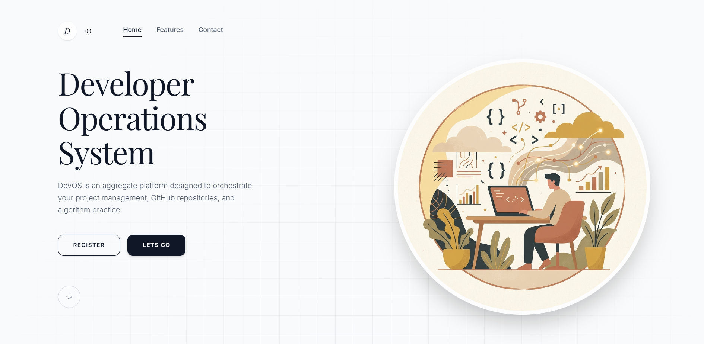

<!-- ══════════════════════════════════════════════════════════
     Ujjawal Bhardwaj · @UBX-CODE · GitHub Profile README
     ══════════════════════════════════════════════════════════ -->

<h1 align="center">Ujjawal Bhardwaj</h1>

  <b>Full-Stack Developer · Software Engineer · Building Scalable Web Products</b>

  Final-year Computer Science student building scalable full-stack applications,
  real-time systems, and high-performance APIs. 
  Focused on clean architecture, performance, and products that solve real problems.

  

 

##  Featured Projects

<table>
<tr>

<td width="50%" valign="top">

<h3 align="center">DevOS</h3>

  

 

**DevOS** is a full-stack developer productivity and project management platform designed to centralize projects, tasks, workflows, and development progress in one workspace.

It focuses on structured project execution, clean architecture, and giving developers a clear view of what they are building and what needs attention next.

**Key Features**

*  Secure authentication and protected routes
*  Project creation and management
*  Task tracking and status workflows
*  Custom workflow management
*  Dashboard statistics and progress insights
*  User profile and settings
*  Modular REST API architecture
*  Responsive developer-focused interface

**Tech Stack**

`React` `TypeScript` `Node.js` `Express` `MongoDB` `Tailwind CSS`

  <a href="https://github.com/UBX-CODE/DevOS">
    <b>View Repository →</b>
  </a>
  &nbsp;&nbsp;•&nbsp;&nbsp;
  <a href="https://dev-os-iota.vercel.app">
    <b>Live Demo →</b>
  </a>

</td>

<td width="50%" valign="top">

<h3 align="center"> MeetFlow</h3>

  

 

**MeetFlow** is a real-time video conferencing platform built for seamless online communication through video meetings, instant messaging, and interactive collaboration.

The project explores real-time communication architecture and the challenges involved in building modern meeting experiences.

**Key Features**

*  Real-time video conferencing
*  Microphone and camera controls
*  Live in-meeting chat
*  Meeting room creation and joining
*  Shareable meeting links
*  Multi-user communication
*  Authentication and protected access
*  Responsive meeting interface

**Tech Stack**

`React` `TypeScript` `Node.js` `Express` `WebRTC` `Socket.IO` `Tailwind CSS`

  <a href="https://github.com/UBX-CODE/MeetFlow">
    <b>View Repository →</b>
  </a>
  &nbsp;&nbsp;•&nbsp;&nbsp;
  <a href="https://meet-flow-six.vercel.app">
    <b>Live Demo →</b>
  </a>

</td>

</tr>
</table>

 

##  Tech Stack & Tools

 

##  My Setup

  

 

##  Connect With Me

<b>
  <a href="https://ubxportfolio.netlify.app/">Portfolio</a>
  &nbsp;•&nbsp;
  <a href="https://www.linkedin.com/in/ujjawal-bhardwaj-643625372/">LinkedIn</a>
  &nbsp;•&nbsp;
  <a href="https://github.com/UBX-CODE">GitHub</a>
  &nbsp;•&nbsp;
  <a href="https://leetcode.com/u/UBX0/">LeetCode</a>
</b>

